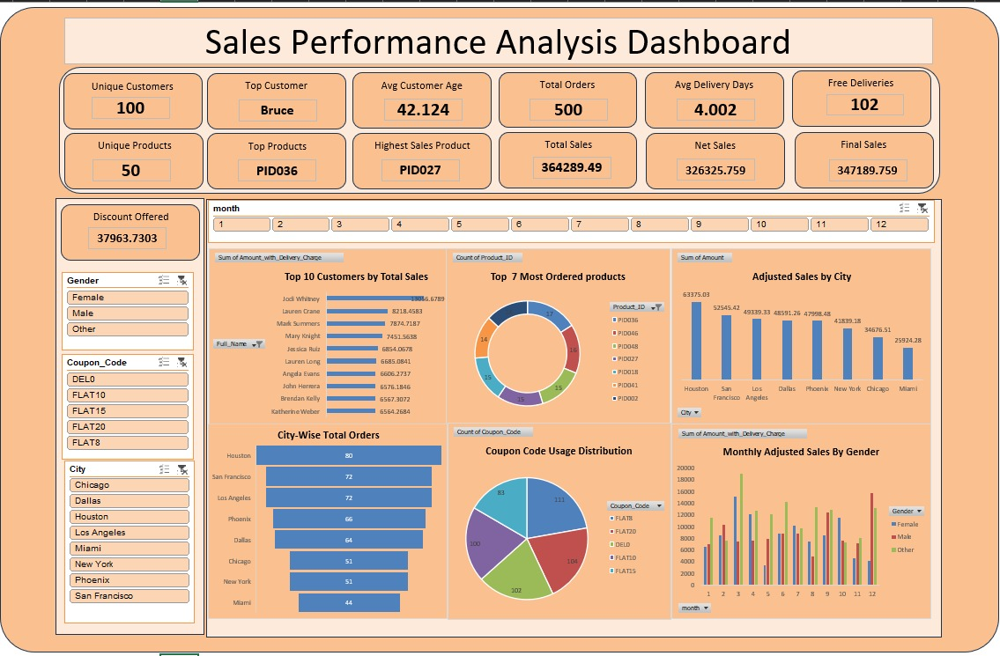

# Sales Performance Analysis Dashboard (Excel)

## Project Overview

The **Sales Performance Analysis Dashboard** is an interactive Microsoft Excel dashboard designed to analyze sales performance using dynamic charts,
Pivot Tables, and slicers. It helps users monitor business performance, identify trends, and make data-driven decisions through an easy-to-use visual interface.

---

## Features

- Interactive Dashboard
- Dynamic Charts
- Pivot Tables
- Pivot Charts
- Slicers for Filtering
- Sales Trend Analysis
- Category-wise Sales Analysis
- Region-wise Performance
- Customer Insights
- KPI Summary

---

## Tools Used

- Microsoft Excel
- Pivot Tables
- Pivot Charts
- Slicers
- Conditional Formatting
- Excel Formulas

---

## Dashboard Insights

The dashboard allows users to:

- Analyze overall sales performance
- Compare sales across different regions
- Identify top-performing categories
- Track customer purchasing trends
- Filter data dynamically using slicers
- Monitor key business metrics

---

## Skills Demonstrated

- Data Cleaning
- Data Analysis
- Dashboard Design
- Business Intelligence
- Data Visualization
- Excel Reporting
- Problem Solving

---

## Preview

---

## Learning Outcome

This project demonstrates the ability to transform raw sales data into meaningful business insights using Microsoft Excel. 
It showcases practical skills in data analysis, visualization, and dashboard creation that are commonly used in business reporting.

---

## Author

**Sankati Akhil Reddy**
